# Crear 4 Motores de Base de Datos con Docker Compose

### 1. Verificar si docker está instalado


verificamos si tenemos el docker y el compose instalado con los siguientes comandos:

```bash
docker --version
```
```bash
docker compose version
```
```bash
sudo systemctl is-active docker
```

**Resultado:**
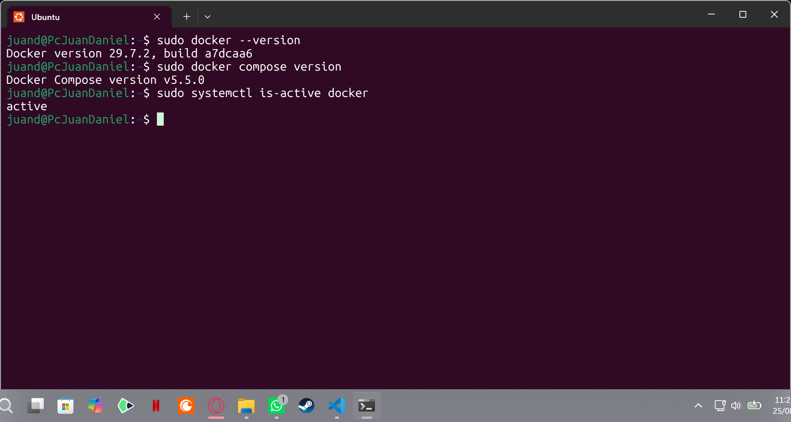

### 2. Paso 1: Crear carpetas

abrirmos la terminal de WSL, e ingresamos los siguientes comandos para crear las carpetas:

``` bash
mkdir -p ~/ia-lab/services/motores-bd/{mysql,postgres,mssql,oracle}
mkdir -p ~/ia-lab/data/{mysql,postgres,mssql,oracle}
```

Verificamos la estructura:

``` bash
tree ~/ia-lab/
```
la estructura de las carpetas quedó de la siguiente manera:

```text
~/ia-lab/
├── services/
│   └── motores-bd/
│       ├── mysql/
│       ├── postgres/
│       ├── mssql/
│       └── oracle/
└── data/
    ├── mysql/
    ├── postgres/
    ├── mssql/
    └── oracle/
```
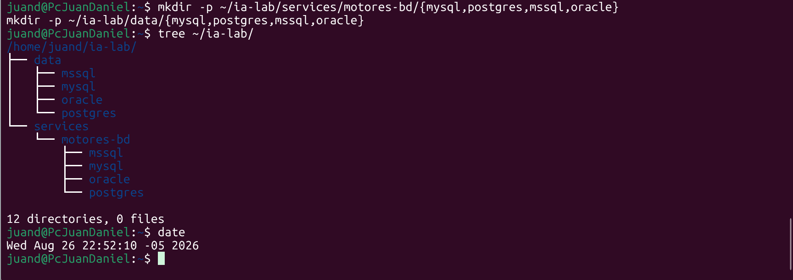

## 3. Paso 2: Crear la Red Docker Compartida

creamos una red docker 

``` bash
docker network inspect ia-lab-network >/dev/null 2>&1 || docker network create ia-lab-network
```

ahora verificamos que esté creado
``` bash
docker network ls | grep ia-lab
```

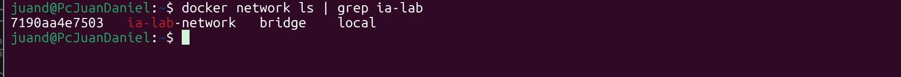

## 4. Paso 3: MySQL

### 4.1 Crear el archivo docker-compose.yml

ingresamos el archivo de configuración de MySQL en la carpeta:
``` bash
cat > ~/ia-lab/services/motores-bd/mysql/docker-compose.yml << 'EOF'
services:
  mysql:
    image: mysql:8.0
    container_name: mysql-server
    restart: unless-stopped
    env_file:
      - .env
    ports:
      - "3306:3306"
    volumes:
      - ../../../data/mysql:/var/lib/mysql
      - /mnt/d/academia/bd:/backups
    command: >
      --character-set-server=utf8mb4
      --collation-server=utf8mb4_unicode_ci
      --bind-address=0.0.0.0
    networks:
      - ia-lab-network
    healthcheck:
      test: ["CMD", "mysqladmin", "ping", "-h", "localhost"]
      interval: 10s
      timeout: 5s
      retries: 5
      start_period: 30s

networks:
  ia-lab-network:
    external: true
EOF
```
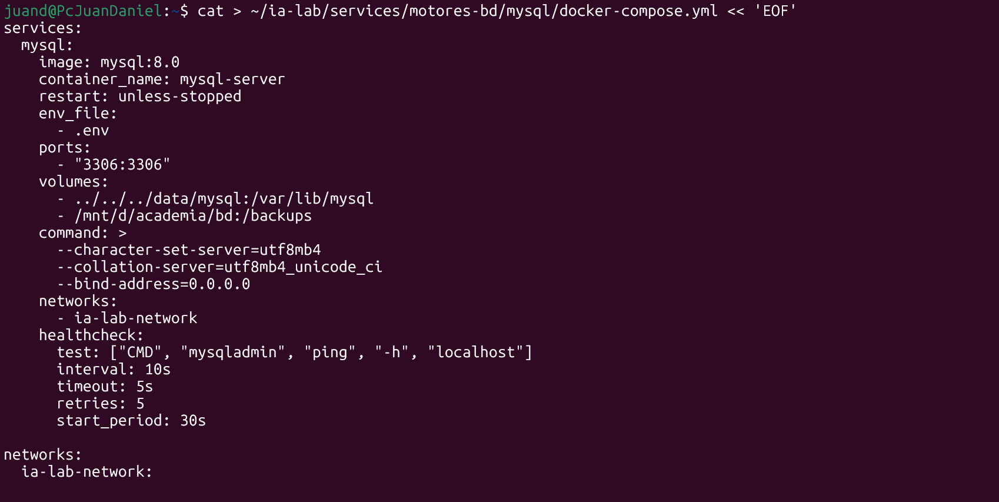
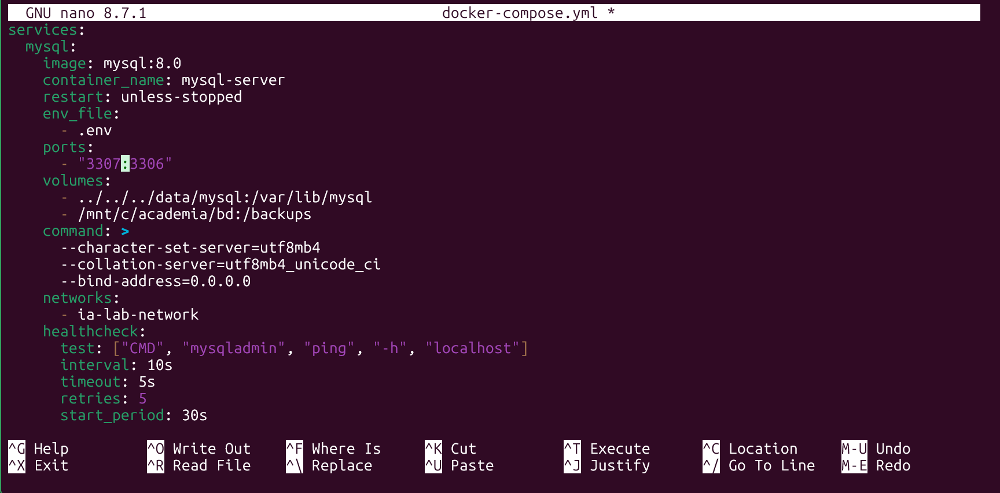
tuve que hacer unas modificaciones menores para conectar el puerto
### 4.2 Crear el archivo .env

``` bash
cat > ~/ia-lab/services/motores-bd/mysql/.env << 'EOF'
TZ=America/Bogota
MYSQL_ROOT_PASSWORD=MiNiCo57**
MYSQL_DATABASE=tecnogua
EOF
```
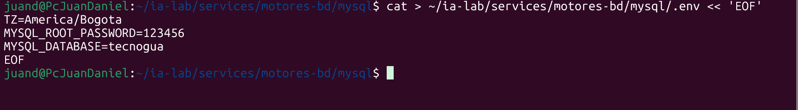

### 4.3 Crear README.md

``` bash
cat > ~/ia-lab/services/motores-bd/mysql/README.md << 'EOF'
# MySQL 8.0 - Motor de Base de Datos

> **Acceso remoto habilitado.** Puerto expuesto en `0.0.0.0:3306`.
> **Usuario por defecto:** `root` (acceso remoto: `%`)

```
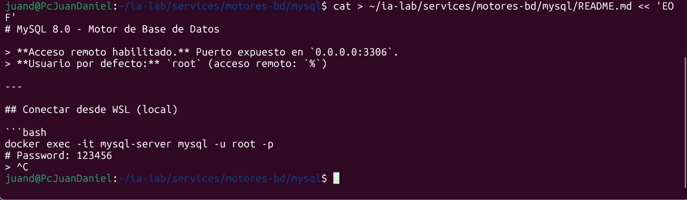


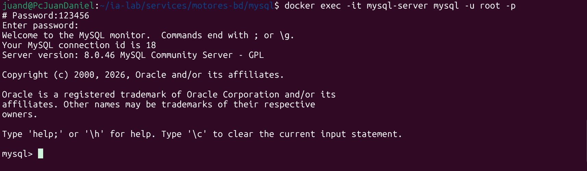

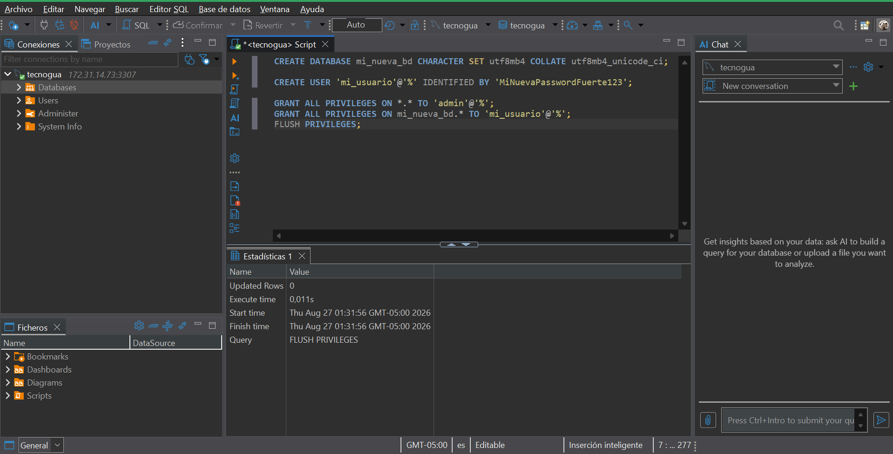
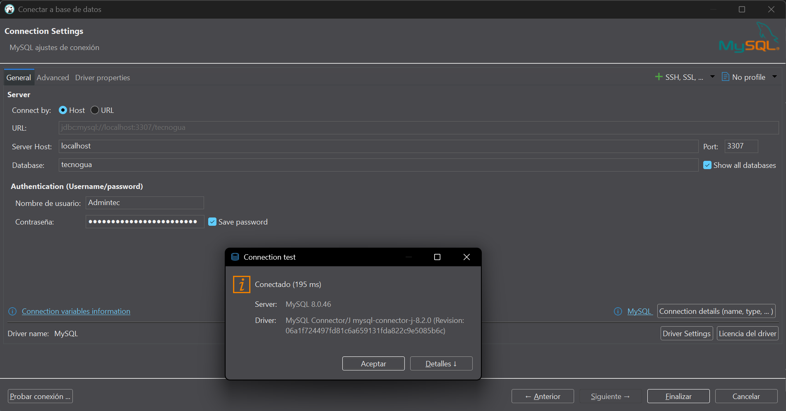

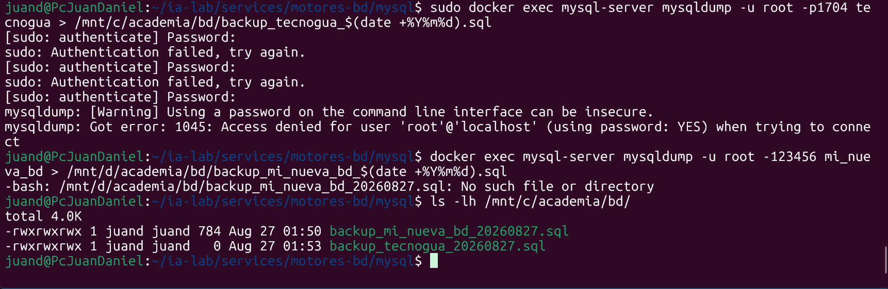

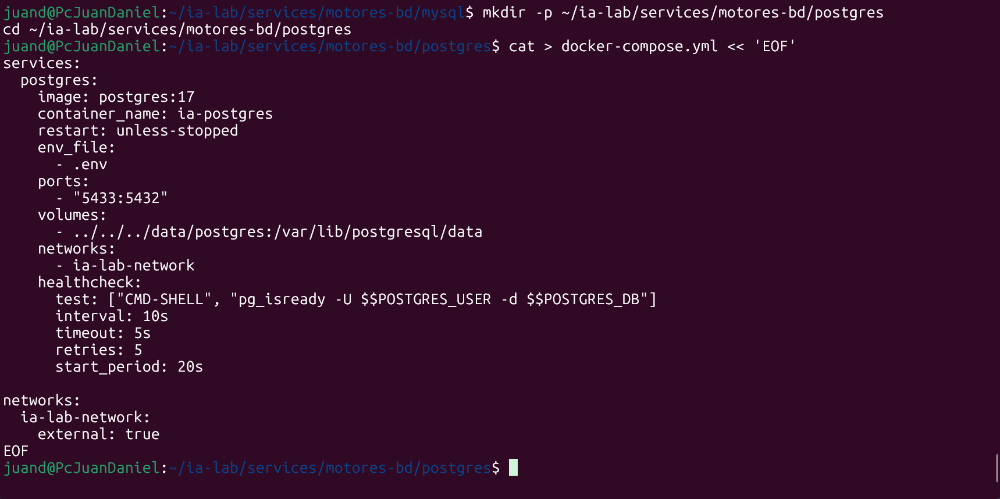

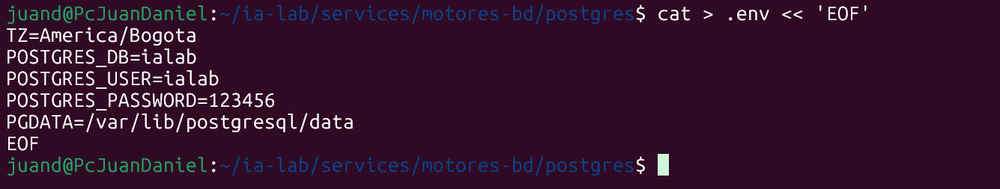

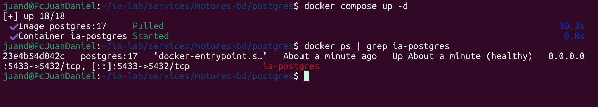

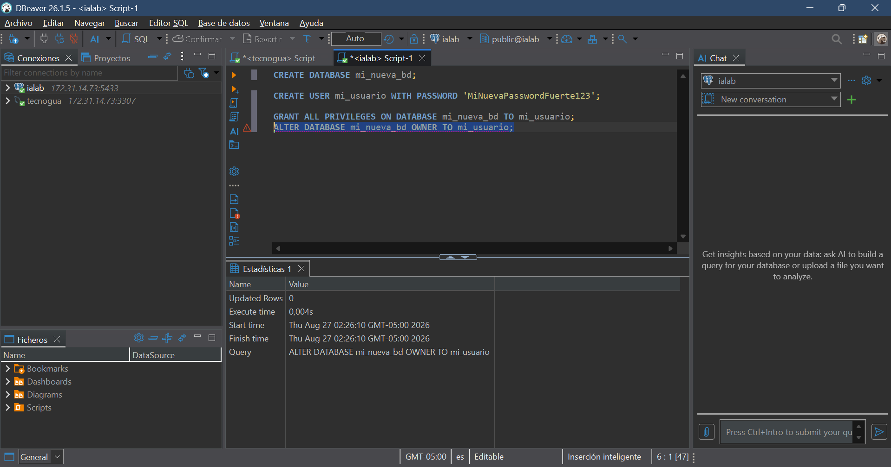

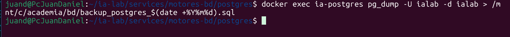

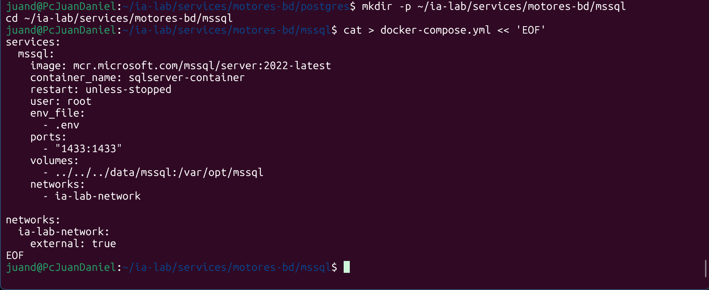

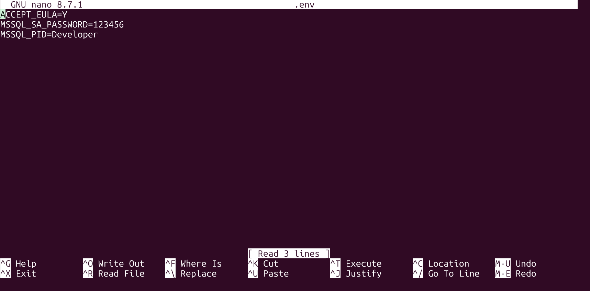

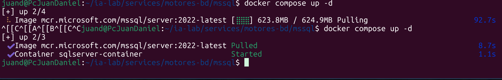

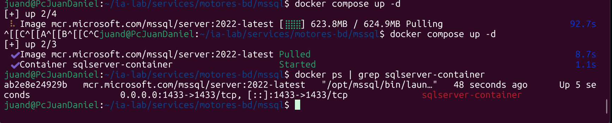

