# Informe de implementación de motores de bases de datos con Docker Compose

## Proyecto 02 — PuntoStock: Comercio minorista multisedes

**Asignatura:** Bases de Datos II

**Estudiante:** Juan Daniel Aguilar Galvis

**Entorno:** Windows + WSL2 + Ubuntu + Docker

**Motores implementados:** MySQL, PostgreSQL, SQL Server y Oracle XE

---

# 1. Introducción

En el presente informe se documenta el proceso de instalación, configuración y puesta en funcionamiento de cuatro motores de bases de datos utilizando Docker Compose dentro de un entorno Ubuntu sobre WSL2.

La infraestructura implementada está conformada por los motores:

* MySQL
* PostgreSQL
* SQL Server
* Oracle XE

Cada motor se ejecuta dentro de un contenedor Docker independiente y se encuentra organizado dentro de una estructura común de directorios.

El objetivo de esta configuración es disponer de un entorno de laboratorio que permita trabajar con distintos sistemas gestores de bases de datos, realizar conexiones locales y remotas, y administrar los motores mediante herramientas gráficas como DBeaver.

Durante la implementación fue necesario realizar algunas modificaciones respecto a la configuración inicial de la guía, principalmente debido a conflictos de puertos y a la organización de los usuarios de algunos motores.

---

# 2. Objetivos

## 2.1. Objetivo general

Implementar una infraestructura de cuatro motores de bases de datos mediante Docker Compose sobre WSL2, permitiendo su administración local y su conexión desde herramientas externas.

## 2.2. Objetivos específicos

* Verificar la instalación de WSL2 y Docker.
* Crear una estructura organizada de directorios.
* Crear una red Docker compartida.
* Configurar MySQL.
* Configurar PostgreSQL.
* Configurar SQL Server.
* Configurar Oracle XE.
* Crear usuarios para acceso remoto.
* Verificar la conexión de los motores mediante DBeaver.
* Crear scripts para iniciar y detener los motores.
* Documentar los problemas y modificaciones realizadas durante la práctica.

---

# 3. Requisitos previos

Antes de iniciar la configuración de los motores de bases de datos se verificó que el entorno contara con las herramientas necesarias.

Los requisitos utilizados fueron:

* WSL2 instalado y funcionando.
* Ubuntu instalado dentro de WSL.
* Docker instalado.
* Docker Compose instalado.
* Acceso a una terminal Bash.

## 3.1. Verificación de Docker

Para comprobar la instalación de Docker se ejecutaron los siguientes comandos:

```bash
sudo docker --version
sudo docker compose version
```

Estos comandos permiten comprobar que Docker y Docker Compose están correctamente instalados dentro del entorno WSL.


---

# 4. Creación de la estructura de carpetas

Para organizar los diferentes motores se crearon carpetas independientes para cada uno.

Se utilizaron los siguientes comandos:

```bash
mkdir -p ~/ia-lab/services/motores-bd/{mysql,postgres,mssql,oracle}
mkdir -p ~/ia-lab/data/{mysql,postgres,mssql,oracle}
```

Posteriormente se verificó la estructura utilizando:

```bash
tree ~/ia-lab/
```

La estructura esperada es:

```text
~/ia-lab/
├── services/
│   └── motores-bd/
│       ├── mysql/
│       ├── postgres/
│       ├── mssql/
│       └── oracle/
└── data/
    ├── mysql/
    ├── postgres/
    ├── mssql/
    └── oracle/
```

La carpeta `services` contiene los archivos de configuración de cada motor.

La carpeta `data` almacena los datos persistentes utilizados por los contenedores.

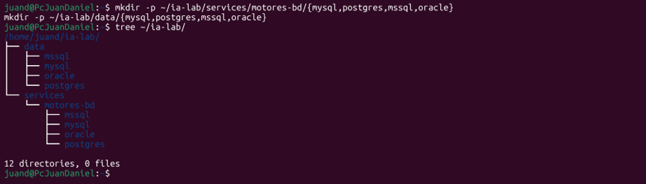

---

# 5. Creación de la red Docker compartida

Los cuatro motores deben compartir una misma red Docker.

La red utilizada se denomina:

```text
ia-lab-network
```

Para crearla se utilizó:

```bash
docker network inspect ia-lab-network >/dev/null 2>&1 || docker network create ia-lab-network
```

Posteriormente se verificó mediante:

```bash
docker network ls | grep ia-lab
```

Esta red permite que todos los contenedores formen parte de la misma infraestructura.

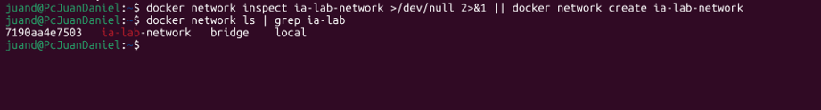

---

# 6. Configuración de MySQL

## 6.1. Creación del archivo `docker-compose.yml`

Dentro del directorio:

```text
~/ia-lab/services/motores-bd/mysql/
```

se creó el archivo:

```text
docker-compose.yml
```

La imagen utilizada fue:

```text
mysql:8.0
```

El nombre asignado al contenedor fue:

```text
mysql-server
```

La configuración incluye:

* Imagen de MySQL 8.0.
* Variables de entorno.
* Persistencia de datos.
* Red Docker compartida.
* Puerto de conexión.
* Healthcheck.

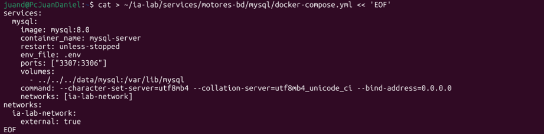

## 6.2. Modificación del puerto

Durante la práctica se presentó un conflicto debido a que el puerto:

```text
3306
```

ya estaba siendo utilizado por otro servicio relacionado con MySQL.

Por esta razón se modificó el puerto externo a:

```text
3307
```

El mapeo utilizado quedó de la siguiente manera:

```yaml
ports:
  - "3307:3306"
```

Esto significa que:

```text
Puerto del equipo:      3307
Puerto del contenedor:  3306
```

La conexión hacia MySQL debe realizarse utilizando el puerto `3307`.

---

## 6.3. Creación del archivo `.env`

También se creó el archivo:

```text
.env
```

Este archivo contiene las variables utilizadas por el contenedor.

Ejemplo:

```env
TZ=America/Bogota
MYSQL_ROOT_PASSWORD=123456
MYSQL_DATABASE=puntostock
```

La contraseña se oculta en este informe por motivos de seguridad.

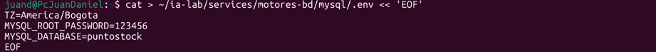

---

## 6.4. Creación del archivo README

Dentro de la carpeta de MySQL se creó un archivo:

```text
README.md
```

Este archivo contiene información relacionada con:

* Puerto del motor.
* Usuario administrador.
* Conexión local.
* Conexión remota.
* Creación de usuarios.
* Copias de seguridad.

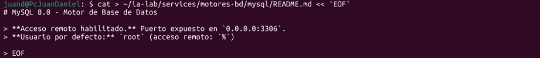

---

## 6.5. Levantamiento de MySQL

Para iniciar MySQL se utilizaron los siguientes comandos:

```bash
cd ~/ia-lab/services/motores-bd/mysql
docker compose up -d
```

Posteriormente se verificó que el contenedor estuviera ejecutándose:

```bash
docker ps | grep mysql-server
```

También se revisaron los logs:

```bash
docker logs mysql-server --tail 20
```

---

## 6.6. Conexión local a MySQL

Para conectarse al motor directamente desde WSL se utilizó:

```bash
docker exec -it mysql-server mysql -u root -p
```

Luego se introduce la contraseña configurada en el archivo `.env`.

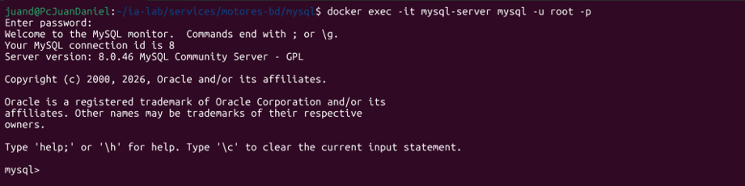

---

## 6.7. Creación de usuario remoto en MySQL

Para crear un usuario con acceso remoto se puede utilizar:

```sql
CREATE DATABASE PuntoStock
CHARACTER SET utf8mb4
COLLATE utf8mb4_unicode_ci;

CREATE USER 'PuntoStock_admin'@'%'
IDENTIFIED BY '123456';

GRANT ALL PRIVILEGES
ON PuntoStock.*
TO 'PuntoStock_admin'@'%';

FLUSH PRIVILEGES;
```

Para verificar el usuario:

```sql
SELECT user, host
FROM mysql.user
WHERE host = '%';
```

El símbolo `%` permite conexiones desde diferentes equipos.

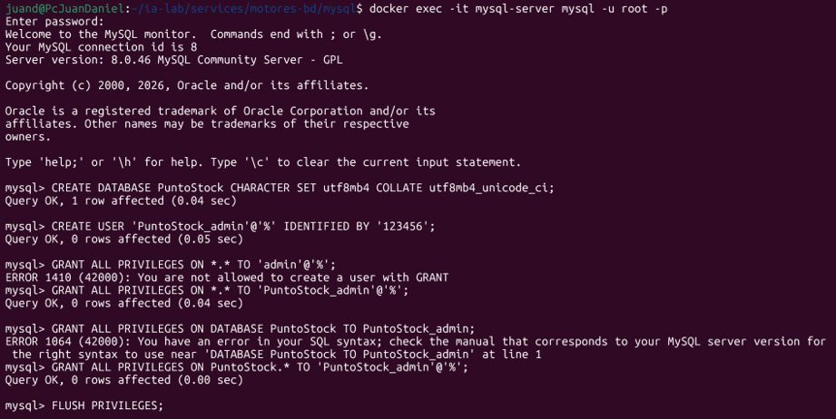

---

## 6.8. Conexión desde DBeaver

Los datos utilizados para la conexión son:

```text
Host: IP de WSL
Puerto: 3307
Usuario: PuntoStock_admin
Contraseña: 123456
Base de datos: PuntoStock
```

Luego se utiliza la opción:

```text
Test Connection
```

para comprobar que la conexión funciona correctamente.

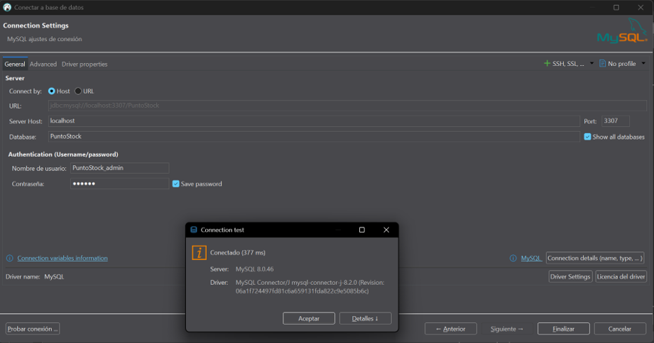

---

# 7. Configuración de PostgreSQL

## 7.1. Creación del `docker-compose.yml`

Dentro de:

```text
~/ia-lab/services/motores-bd/postgres/
```

se creó el archivo:

```text
docker-compose.yml
```

La imagen utilizada fue:

```text
postgres:17
```

El contenedor se llamó:

```text
ia-postgres
```

El puerto externo configurado fue:

```text
5433
```

mientras que PostgreSQL utiliza internamente el puerto:

```text
5432
```

La configuración queda:

```text
5433:5432
```

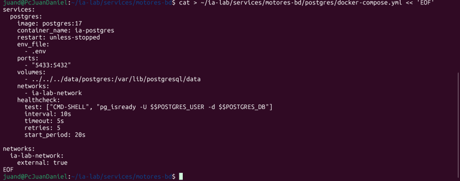

---

## 7.2. Creación del archivo `.env`

El archivo `.env` contiene:

```env
TZ=America/Bogota
POSTGRES_DB=ialab
POSTGRES_USER=ialab
POSTGRES_PASSWORD=********
PGDATA=/var/lib/postgresql/data
```

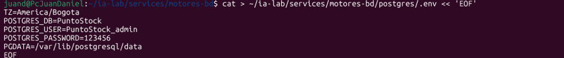

---

## 7.3. Creación del README

Se creó:

```text
README.md
```

con la documentación relacionada con PostgreSQL.

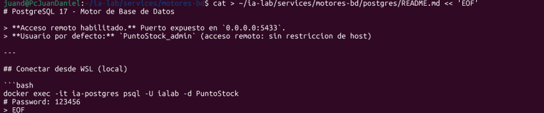

---

## 7.4. Separación de usuarios

Durante la configuración se detectó una posible confusión entre el usuario administrativo y el usuario destinado a conexiones remotas.

Por esta razón se decidió mantener una separación.

El usuario administrativo utilizado para trabajar localmente es:

```text
PuntoStock
```

Mientras que el usuario creado para realizar pruebas remotas es:

```text
PuntoStock_admin
```

Esta separación facilita la administración de permisos.

---

## 7.5. Levantamiento de PostgreSQL

Se utilizaron los siguientes comandos:

```bash
cd ~/ia-lab/services/motores-bd/postgres
docker compose up -d
```

Para verificar:

```bash
docker ps
```

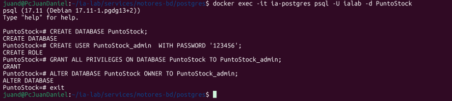

---

## 7.6. Conexión local

La conexión local puede realizarse mediante:

```bash
docker exec -it ia-postgres psql -U ialab -d ialab
```


---

## 7.7. Creación de usuario remoto

Dentro de PostgreSQL se pueden ejecutar los siguientes comandos:

```sql
CREATE DATABASE PuntoStock;

CREATE USER PuntoStock_admin
WITH PASSWORD '123456';

GRANT ALL PRIVILEGES
ON DATABASE PuntoStock
TO PuntoStock_admin;

ALTER DATABASE PuntoStock
OWNER TO PuntoStock_admin;
```

Para verificar los usuarios:

```sql
\du
```


---

## 7.8. Conexión desde DBeaver

La configuración utilizada es:

```text
Host: IP de WSL
Puerto: 5433
Database: PuntoStock
Usuario: puntostock_admin
Contraseña: 123456
```
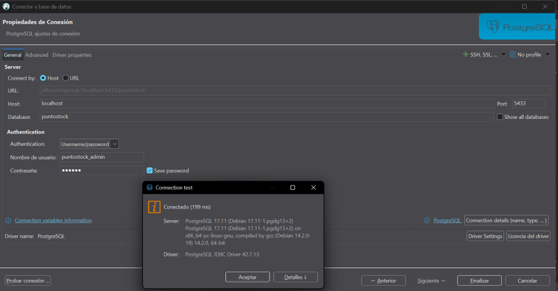
---

# 8. Configuración de SQL Server

## 8.1. Creación del `docker-compose.yml`

Dentro del directorio:

```text
~/ia-lab/services/motores-bd/mssql/
```

se creó el archivo correspondiente.

La imagen utilizada es:

```text
mcr.microsoft.com/mssql/server:2022-latest
```

El contenedor se denomina:

```text
sqlserver-container
```

El puerto utilizado es:

```text
1433
```

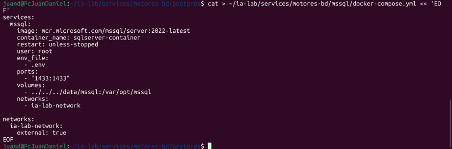

---

## 8.2. Archivo `.env`

Se creó el archivo:

```text
.env
```

con el siguiente contenido:

```env
ACCEPT_EULA=Y
MSSQL_SA_PASSWORD=********
MSSQL_PID=Developer
```

La variable:

```text
ACCEPT_EULA=Y
```

permite aceptar los términos de licencia necesarios para iniciar SQL Server.

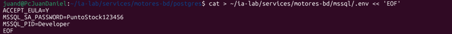

---

## 8.3. Creación del README

Se creó:

```text
README.md
```

para documentar los comandos y parámetros de conexión.

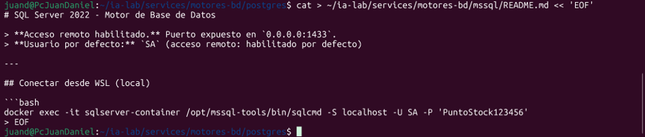

---

## 8.4. Levantamiento de SQL Server

Para iniciar el motor se ejecutó:

```bash
cd ~/ia-lab/services/motores-bd/mssql
docker compose up -d
```

Luego se verificó mediante:

```bash
docker ps
```

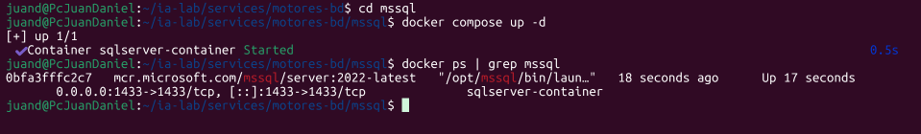

---

## 8.5. Conexión local

La conexión mediante `sqlcmd` puede realizarse con:

```bash
docker exec -it sqlserver-container \
/opt/mssql-tools/bin/sqlcmd \
-S localhost \
-U SA \
-P '********'
```

---

## 8.6. Creación de usuario remoto

Primero se crea la base de datos:

```sql
CREATE DATABASE PuntoStock;
GO
```

Luego se crea un login:

```sql
CREATE LOGIN PuntoStock_admin
WITH PASSWORD = '123456';
GO
```

Posteriormente se selecciona la base de datos:

```sql
USE PuntoStock;
GO
```

Se crea el usuario:

```sql
CREATE USER PuntoStock_admin
FOR LOGIN PuntoStock_admin;
GO
```

Finalmente se asignan permisos:

```sql
ALTER ROLE db_owner
ADD MEMBER PuntoStock_admin;
GO
```

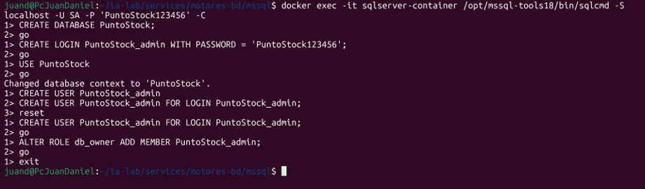

---

## 8.7. Conexión desde DBeaver

Datos generales:

```text
Host: IP de WSL
Puerto: 1433
Usuario: PuntoStock_admin
Contraseña: PuntoStock123456
Base de datos: PuntoStock
```

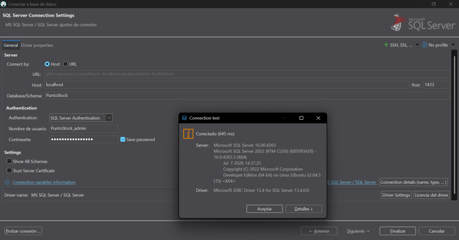

---

# 9. Configuración de Oracle XE

## 9.1. Creación del `docker-compose.yml`

Para Oracle se utilizó la imagen:

```text
gvenzl/oracle-xe
```

El nombre del contenedor es:

```text
oracle-xe
```

Los puertos utilizados son:

```text
1521
8080
```

El puerto principal para las conexiones de base de datos es:

```text
1521
```

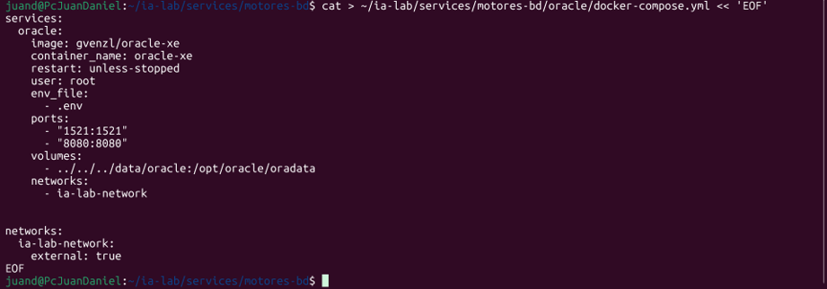

---

## 9.2. Creación del archivo `.env`

Se utilizó:

```env
ORACLE_PASSWORD=********
ORACLE_DATABASE=XE
```

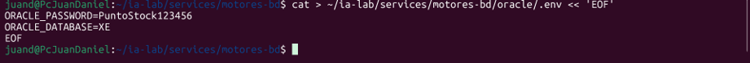

---

## 9.3. Creación del README

Se creó un archivo:

```text
README.md
```

con la información correspondiente al motor Oracle.

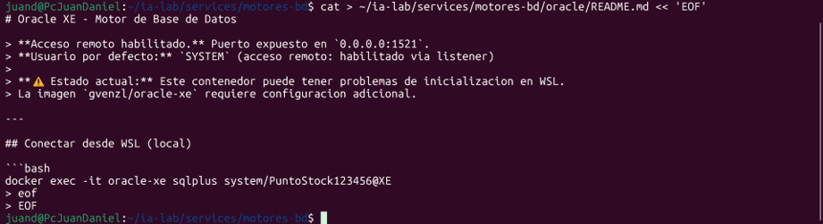

---

## 9.4. Levantamiento de Oracle

Para iniciar Oracle se utiliza:

```bash
cd ~/ia-lab/services/motores-bd/oracle
docker compose up -d
```

Luego se puede revisar su estado:

```bash
docker ps
```

También pueden consultarse los logs:

```bash
docker logs oracle-xe
```


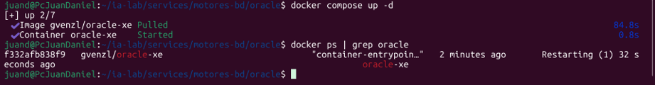
---

## 9.5. Consideración sobre Oracle XE

Oracle XE puede presentar problemas de inicialización dentro de WSL.

Por este motivo se recomienda revisar los logs del contenedor si el servicio no inicia correctamente:

```bash
docker logs oracle-xe --tail 50
```

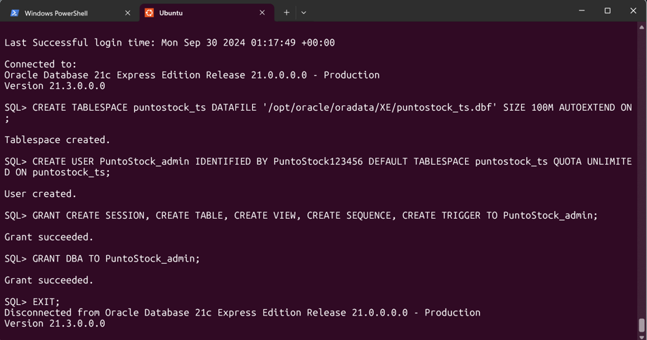

---

## 9.6. Conexión local

La conexión se puede realizar mediante:

```bash
docker exec -it oracle-xe \
sqlplus system/********@XE
```

---

## 9.7. Creación de usuario

Primero se crea un tablespace:

```sql
CREATE TABLESPACE practica_ts
DATAFILE '/opt/oracle/oradata/XE/practica_ts.dbf'
SIZE 100M
AUTOEXTEND ON;
```

Posteriormente se crea el usuario:

```sql
CREATE USER PuntoStock_admin
IDENTIFIED BY PuntoStock123456
DEFAULT TABLESPACE puntostock_ts
QUOTA UNLIMITED ON puntostock_ts;
```

Finalmente se asignan permisos:

```sql
GRANT CREATE SESSION,
      CREATE TABLE,
      CREATE VIEW,
      CREATE SEQUENCE,
      CREATE TRIGGER
TO PuntoStock_admin;
```

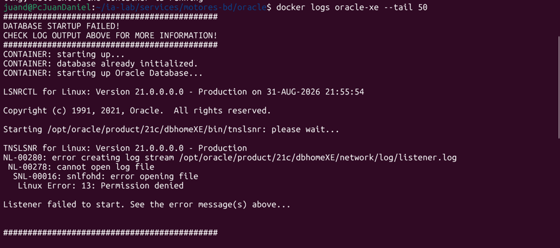

---

# 10. Obtención de la IP de WSL

Para realizar las conexiones desde DBeaver es necesario conocer la dirección IP de WSL.

Se utilizó:

```bash
hostname -I
```

El comando devuelve una o varias direcciones IP.

La dirección correspondiente al entorno WSL se utiliza como `Host` en DBeaver.

Ejemplo:

```text
172.20.123.45
```

---

# 11. Verificación general de los motores

Después de iniciar todos los contenedores se utilizó:

```bash
docker ps --format "table {{.Names}}\t{{.Status}}\t{{.Ports}}"
```

El resultado esperado debe mostrar los cuatro contenedores activos.

Ejemplo:

```text
NAMES                  STATUS          PORTS
mysql-server           Up              0.0.0.0:3307->3306/tcp
ia-postgres            Up              0.0.0.0:5433->5432/tcp
sqlserver-container    Up              0.0.0.0:1433->1433/tcp
oracle-xe              Up              0.0.0.0:1521->1521/tcp
```

---

# 12. Scripts de control

Para facilitar la administración de los motores se crearon scripts para iniciar y detener todos los contenedores.

## 12.1. Script `start-all.sh`

Se creó:

```text
~/ia-lab/services/motores-bd/start-all.sh
```

Contenido:

```bash
#!/bin/bash

set -e

BASE=~/ia-lab/services/motores-bd

echo "========================================"
echo "Iniciando motores de base de datos..."
echo "========================================"

for dir in mysql postgres mssql oracle; do

    echo ""
    echo ">>> Levantando $dir..."

    cd "$BASE/$dir"

    docker compose up -d

    echo "$dir: OK"

done

echo ""
echo "========================================"
echo "Todos los motores iniciados."
echo "========================================"
```

Se asignaron permisos de ejecución:

```bash
chmod +x ~/ia-lab/services/motores-bd/start-all.sh
```

Para ejecutarlo:

```bash
~/ia-lab/services/motores-bd/start-all.sh
```

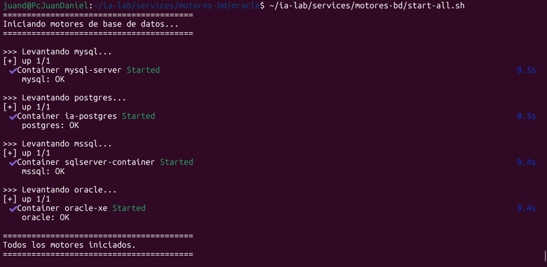

---

## 12.2. Script `stop-all.sh`

También se creó:

```text
~/ia-lab/services/motores-bd/stop-all.sh
```

Contenido:

```bash
#!/bin/bash

set -e

BASE=~/ia-lab/services/motores-bd

echo "========================================"
echo "Deteniendo motores de base de datos..."
echo "========================================"

for dir in mysql postgres mssql oracle; do

    echo ""
    echo ">>> Deteniendo $dir..."

    cd "$BASE/$dir"

    docker compose down

    echo "$dir: OK"

done

echo ""
echo "========================================"
echo "Todos los motores detenidos."
echo "========================================"
```

Se asignaron permisos:

```bash
chmod +x ~/ia-lab/services/motores-bd/stop-all.sh
```

Para ejecutarlo:

```bash
~/ia-lab/services/motores-bd/stop-all.sh
```

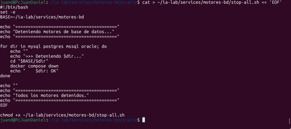

---

# 13. Arquitectura final

La arquitectura implementada puede representarse de la siguiente manera:

```text
                    WINDOWS
                       │
                       │
             ┌─────────┴─────────┐
             │                   │
          DBeaver          MySQL Workbench
             │
             │
             ▼
        WSL2 / Ubuntu
             │
             ▼
           Docker
             │
             ▼
      ia-lab-network
             │
   ┌─────────┼─────────┬─────────┐
   │         │         │         │
   ▼         ▼         ▼         ▼
 MySQL   PostgreSQL SQL Server Oracle XE
 3307      5433       1433      1521
```

Todos los motores se ejecutan dentro de Docker y comparten la red:

```text
ia-lab-network
```

---

# 14. Resumen de configuración

| Motor      | Contenedor            | Puerto externo | Puerto interno | Usuario administrador |
| ---------- | --------------------- | -------------: | -------------: | --------------------- |
| MySQL      | `mysql-server`        |           3307 |           3306 | `root`                |
| PostgreSQL | `ia-postgres`         |           5433 |           5432 | `ialab`               |
| SQL Server | `sqlserver-container` |           1433 |           1433 | `SA`                  |
| Oracle XE  | `oracle-xe`           |           1521 |           1521 | `SYSTEM`              |

---

# 15. Problemas encontrados

Durante la configuración se presentaron algunas situaciones que requirieron modificar la configuración inicial.

## 15.1. Conflicto con el puerto de MySQL

El puerto predeterminado:

```text
3306
```

ya estaba siendo utilizado.

Por esta razón se modificó el puerto externo a:

```text
3307
```

manteniendo el puerto interno del contenedor en:

```text
3306
```

El resultado fue:

```text
3307:3306
```

---

## 15.2. Organización de usuarios en PostgreSQL

Se identificó una posible confusión entre el usuario administrativo y el usuario destinado a conexiones externas.

Por este motivo se decidió utilizar:

```text
ialab
```

como usuario administrativo y:

```text
PuntoStock_admin
```

como usuario para las prácticas de conexión remota.

---

## 15.3. Oracle XE

Durante la creación del usuario remoto de Oracle XE en WSL, me enfrenté a un par de problemas críticos relacionados con los permisos de los registros internos del listener y el conflicto de nombres al intentar inicializar la Pluggable Database (PDB). A continuación, detallo cómo solucioné cada inconveniente.

### 1. Error de Permisos en el Listener (`Linux Error: 13: Permission denied`)

Al levantar el contenedor por primera vez, el proceso falló de manera cíclica (`Restarting`). Al revisar los registros con el comando:

```bash
sudo docker logs oracle-xe --tail 50
```


## Solución aplicada:
Este fallo ocurre porque la imagen oficial ejecuta sus procesos internos con un usuario sin privilegios llamado oracle, y las restricciones del directorio físico bloqueaban la escritura. Para solucionarlo, eliminé la directiva user: root del archivo docker-compose.yml y otorgué permisos completos de lectura y escritura al volumen persistente en WSL:

```bash
sudo chmod -R 777 ~/ia-lab/data/oracle
```

Posteriormente, al configurar el archivo .env intentando forzar el nombre de la base de datos como XE o XEPDB1, el motor se detenía arrojando un error de conflicto debido a que la imagen de Oracle XE ya trae una estructura predefinida en su contenedor raíz (CDB).

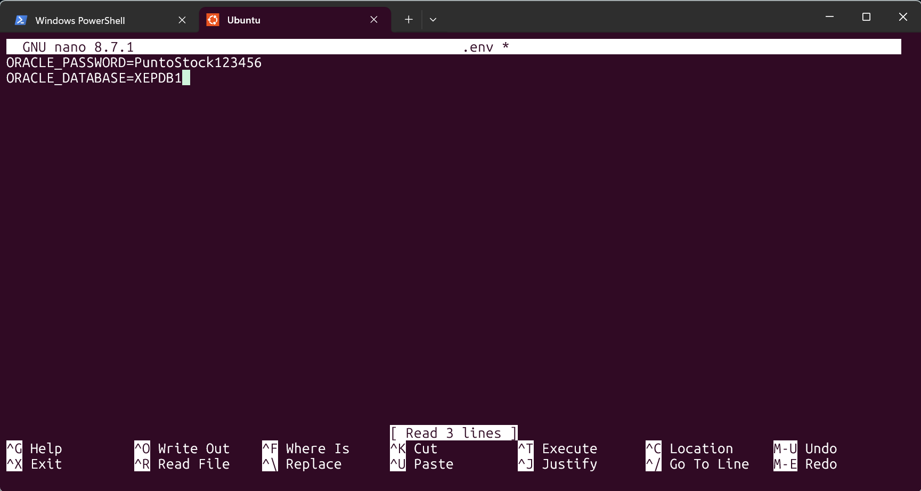

Para evitar que el script interno intente duplicar la PDB, retiré la variable ORACLE_DATABASE del archivo .env, dejando únicamente la contraseña de administración. De esta manera, el contenedor utiliza la PDB por defecto que trae integrada (XEPDB1) sin generar colisiones:

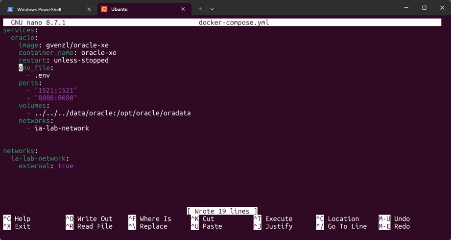

---

# 16. Resultados

Después de realizar la configuración se logró implementar una infraestructura que permite trabajar con cuatro motores de bases de datos diferentes dentro del mismo entorno.

La práctica permitió:

* Ejecutar MySQL mediante Docker.
* Ejecutar PostgreSQL mediante Docker.
* Ejecutar SQL Server mediante Docker.
* Ejecutar Oracle XE mediante Docker.
* Mantener persistencia de datos.
* Utilizar una red Docker compartida.
* Crear usuarios independientes.
* Realizar conexiones mediante DBeaver.
* Administrar los motores mediante scripts.
* Identificar diferencias entre los sistemas gestores de bases de datos.

---

# 17. Conclusiones

La práctica permitió comprender el proceso de configuración y despliegue de diferentes motores de bases de datos utilizando Docker Compose.

Docker facilita la creación de entornos independientes para cada sistema gestor de bases de datos, evitando la necesidad de instalar directamente todos los motores sobre el sistema operativo principal.

También se pudo comprobar que cada motor utiliza diferentes mecanismos de administración de usuarios y permisos.

MySQL permite crear usuarios asociados a determinados hosts mediante:

```sql
CREATE USER 'usuario'@'%';
```

PostgreSQL utiliza usuarios o roles directamente dentro del servidor.

SQL Server diferencia entre:

```text
LOGIN
```

y:

```text
USER
```

mientras que Oracle requiere la creación de usuarios asociados a tablespaces.

Otro aprendizaje importante fue la administración de puertos. El conflicto presentado con MySQL demostró que los puertos externos de Docker pueden modificarse sin alterar el puerto interno utilizado por el servicio.

Finalmente, la utilización de DBeaver permitió comprobar que los motores podían ser administrados desde una herramienta gráfica externa, mientras que los scripts `start-all.sh` y `stop-all.sh` facilitaron el control general de la infraestructura.

---

# 18. Anexos

## 18.1. Comandos útiles

### Ver contenedores activos

```bash
docker ps
```

### Ver todos los contenedores

```bash
docker ps -a
```

### Ver redes Docker

```bash
docker network ls
```

### Ver IP de WSL

```bash
hostname -I
```

### Ver logs de MySQL

```bash
docker logs mysql-server --tail 50
```

### Ver logs de PostgreSQL

```bash
docker logs ia-postgres --tail 50
```

### Ver logs de SQL Server

```bash
docker logs sqlserver-container --tail 50
```

### Ver logs de Oracle

```bash
docker logs oracle-xe --tail 50
```

### Iniciar todos los motores

```bash
~/ia-lab/services/motores-bd/start-all.sh
```

### Detener todos los motores

```bash
~/ia-lab/services/motores-bd/stop-all.sh
```

---

## 18.2. Estructura final de archivos

```text
~/ia-lab/
│
├── services/
│   └── motores-bd/
│       │
│       ├── mysql/
│       │   ├── docker-compose.yml
│       │   ├── .env
│       │   └── README.md
│       │
│       ├── postgres/
│       │   ├── docker-compose.yml
│       │   ├── .env
│       │   └── README.md
│       │
│       ├── mssql/
│       │   ├── docker-compose.yml
│       │   ├── .env
│       │   └── README.md
│       │
│       ├── oracle/
│       │   ├── docker-compose.yml
│       │   ├── .env
│       │   └── README.md
│       │
│       ├── start-all.sh
│       └── stop-all.sh
│
└── data/
    ├── mysql/
    ├── postgres/
    ├── mssql/
    └── oracle/
```
